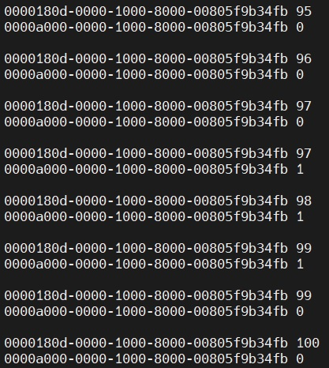

#111_2_ESLAB_HW4

Team members: 吳紹睿(b08901113), 林家弘(b08901112)

We implement 2 services:
1. Heartrate: Send BPM value
2. Button: The value is initially 0x00. If the user button falls, send 0x01. If the user button falls, send 0x00.

* STM device name: Fake device

* Usage:
1. Run mbed-os-ESLAB-HW4 on STM
2. Run Central_RPi.py on RPi
3. Search the number of the device name "Fake device"
4. Input the number
5. Get the values of the services

* Received message: (Fig. 1)
0000180d-0000-1000-8000-00805f9b34fb <Heartrate BPM value>
0000180d-0000-1000-8000-00805f9b34fb <Button value>

**Fig. 1** Screen shot
